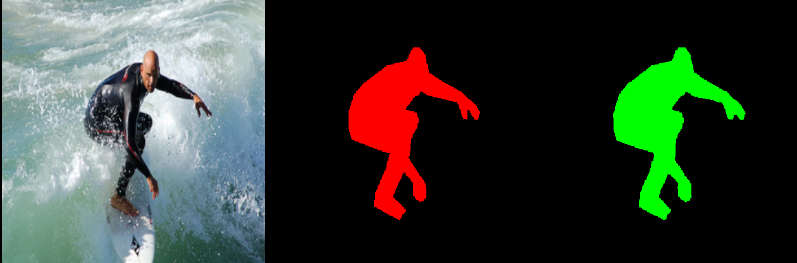
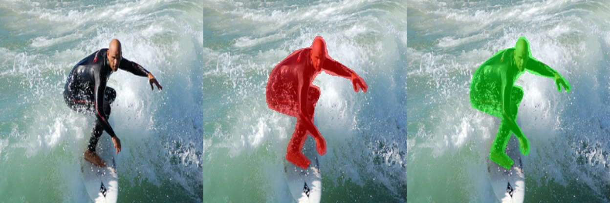

# AdaContour

## Introduction

We propose **AdaContour**, an adaptive contour descriptor that uses multiple local representations to desirably characterize complex shapes. After hierarchically encoding object shapes in a training set and constructing a contour matrix of all subdivided regions, we compute a robust low-rank robust subspace and approximate each local contour by linearly combining the shared basis vectors to represent an object. 

AdaContour is able to represent shapes more accurately and robustly than other descriptors while retaining effectiveness.

## Minimum Installation

~~~
conda create -n AdaContour python=3.7
conda activate AdaContour

pip install opencv-python
conda install pytorch==1.7.0 torchvision==0.8.0 torchaudio==0.7.0 cudatoolkit=11.0 -c pytorch
conda install scikit-image
~~~

## Quick Start

For a quick understanding of how hierarchical representation works, we provide a demo script that runs AdaContour on a sample data point.

~~~
python demo.py --image_id 1
~~~

This will run the demo on the first sample data point in `sample_data`. The output will be saved in the `output` folder, which looks like this:

And it prints the following output:
~~~
=================================================================
image id = 1
solidtiy = 0.57
eccentricity = 0.78
area ratio = 0.12 (20363 / 173056)
=================================================================
depth = 0, iou = 0.78, # of centers = 1
depth = 1, iou = 0.86, # of centers = 2
depth = 2, iou = 0.92, # of centers = 4
depth = 3, iou = 0.95, # of centers = 7
depth = 4, iou = 0.97, # of centers = 12
depth = 5, iou = 0.98, # of centers = 18
Done!All results saved in output/
=================================================================
~~~

## Pipeline: Encoding, Factorization, and Convert

Here, we use the sample data in `sample_data` as an example for the pipeline.

### Step 1. Encoding

~~~
python main.py --stage encoding --mode hierarchy_encoding --datalist demo --dataset demo  --max_depth 5 --process_mode hybrid --save --display
~~~

The encoded information is saved as a h5 file in the `output` folder. With `--display`, you can see the visualizations for (RGB, GT mask, AdaContour encoded mask), such as:

### Step 2. Factorization

~~~
python main.py --stage factorization --mode hierarchy_encoding --datalist demo --dataset demo --max_depth 5 --process_mode hybrid --fms --dim 50 --save
~~~

Use `dim` to set the dimension of the low-rank subspace. It will save the original matrix and the low-rank matrix in the `output` folder. Here we use FMS instead of SVD, which is a more robust method to compute the shared basis.

### Step 3. Convert

~~~
python main.py --stage convert --mode hierarchy_encoding --datalist demo --dataset demo --max_depth 5 --process_mode hybrid --save --method fms --dim 50 --display
~~~

Use the shared basis to reconstruct the visualizations for (RGB, AdaContour reconstructed mask, GT w/ mask), such as:

---

For other datasets, like COCO and SBD, please follow [dnjs3594/Eigencontours](https://github.com/dnjs3594/Eigencontours) for dataset preparation.

## Citation

~~~
@article{ding2024adacontour,
  title={AdaContour: Adaptive Contour Descriptor with Hierarchical Representation},
  author={Ding, Tianyu and Zhou, Jinxin and Chen, Tianyi and Zhu, Zhihui and Zharkov, Ilya and Liang, Luming},
  journal={arXiv preprint arXiv:2404.08292},
  year={2024}
}
~~~

## Acknowledgements

The code is largely based on  [dnjs3594/Eigencontours](https://github.com/dnjs3594/Eigencontours).
